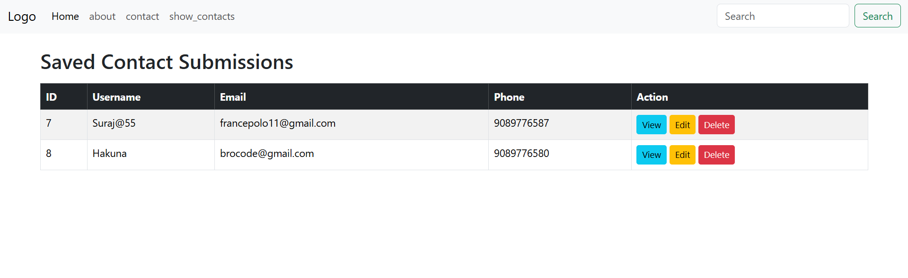
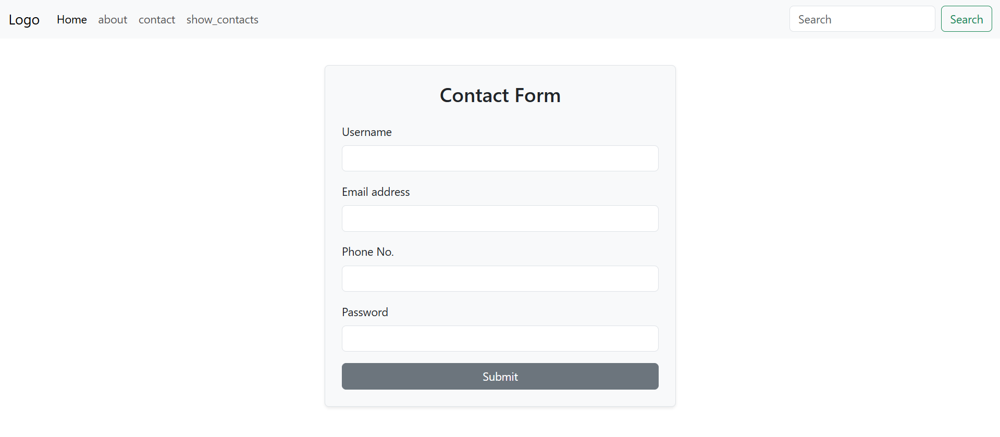

<div align=center>
<a name="top"></a>

# Django Contact App

A simple Django web application for managing contact information. This project includes basic pages like Home, About, and Contact, with full CRUD (Create, Read, Update, Delete) functionality for contact management.

[](https://www.python.org/)
[](https://www.djangoproject.com/)
[](https://getbootstrap.com/)
[](https://www.sqlite.org/)
[](LICENSE)


## screenshot



</div>


## Features

- **Home Page**: Basic landing page
- **About Page**: Information about the site
- **Contact Page**: Registration form with validation
  - Username, Email, Phone, Password fields
  - Email and phone uniqueness validation
  - Success/error messages with auto-hide
- **Contact Management**: Full CRUD operations
  - View all saved contacts in a table format
  - View individual contact details
  - Edit existing contacts
  - Delete contacts with confirmation
- **Admin Panel**: Customized Django admin interface for managing contacts
- **Responsive Design**: Uses Bootstrap 5 for styling

## Technologies Used

- **Backend**: Django 5.2.7
- **Database**: SQLite3
- **Frontend**: HTML, Bootstrap 5
- **Styling**: Bootstrap 5 (CDN)

## Installation

1. **Clone the repository**:
   ```bash
   git clone https://github.com/Ar-jun-fs9/django-contact-crud-app.git
   cd Django_Contact_App
   ```

2. **Install Django**(if not installed):
   ```bash
   pip install django
   ```

3. **Apply migrations**:
   ```bash
   python manage.py migrate
   ```

4. **Run the development server**:
   ```bash
   python manage.py runserver
   ```

5. **Access the application**:
   Open your browser and go to `http://127.0.0.1:8000/`

## Usage

- Navigate through the Home, About, Contact, and Show Contacts pages using the navigation bar.
- On the Contact page, fill out the registration form. The system will validate that email and phone are unique.
- On the Show Contacts page, view all submitted contacts in a table with options to View, Edit, or Delete each contact.
- Use the View button to see detailed information about a specific contact.
- Use the Edit button to modify contact information.
- Use the Delete button to remove a contact (with confirmation prompt).
- Access the admin panel at `http://127.0.0.1:8000/admin/` (create a superuser with `python manage.py createsuperuser` if needed).

## Project Structure

```
Django_Contact_App/
├── 📁 django_contact_app/        # Main Django project directory
│   ├── 📄 __init__.py
│   ├── 📄 asgi.py
│   ├── 📄 settings.py            # Django settings
│   ├── 📄 urls.py                # Main URL configuration
│   └── 📄 wsgi.py
│
├── 📁 contact/                   # Django app for contact functionality
│   ├── 📄 __init__.py
│   ├── 📄 admin.py               # Admin configuration
│   ├── 📄 apps.py
│   ├── 📄 models.py              # Contact model
│   ├── 📄 tests.py
│   ├── 📄 urls.py                # App URL configuration
│   ├── 📄 views.py               # Views for pages
│   └── 📁 migrations/            # Database migrations
│       ├── 📄 __init__.py
│       └── 📄 0001_initial.py
│
├── 📁 templates/                 # HTML templates
│   ├── 📄 base.html              # Base template with Bootstrap
│   ├── 📄 index.html             # Home page
│   ├── 📄 about.html             # About page
│   ├── 📄 contact.html           # Contact/registration page
│   ├── 📄 show_contacts.html     # List all contacts
│   ├── 📄 contact_view.html      # View individual contact
│   └── 📄 contact_edit.html      # Edit contact form
│
├── 📁 static/                    # Static files directory
│   └── 📄 text.txt               # Sample static file
│
├── 📁 assets/                    # Project images / assets
│   ├── 🖼️ contact.png            # Contact form page screenshot
│   └── 🖼️ contact_list.png       # Contact list page screenshot
│
├── 📄 db.sqlite3                 # SQLite database
└── 📄 manage.py                  # Django management script
```

## Database Model

The application uses a single model `Contact` with the following fields:
- `username`: CharField (max 50)
- `email`: EmailField (unique)
- `phone`: CharField (max 10, unique)
- `password`: CharField (max 128)

## 📄 License

[](#)

<div align="center">
   
  **[⬆ Back to Top](#top)**
  
</div>